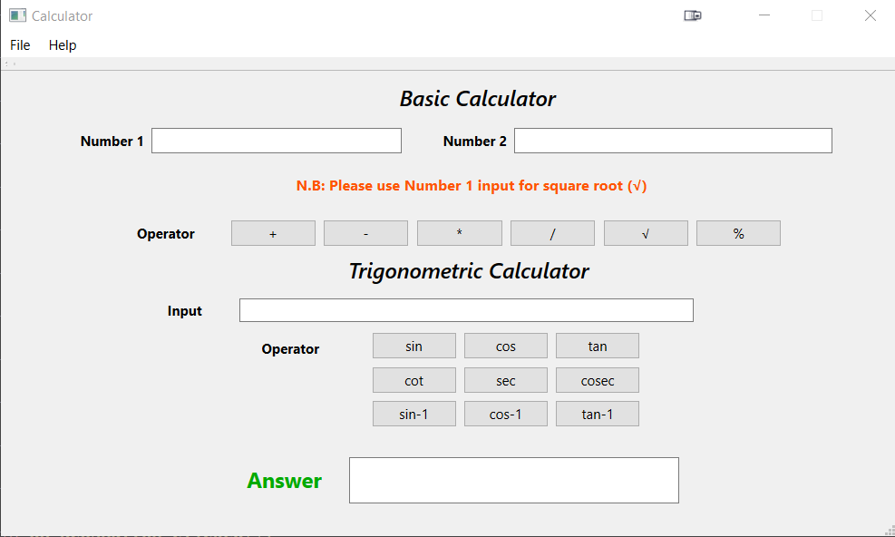

# Qt Simple Calculator Software

A versatile calculator application developed with Qt Creator, featuring basic arithmetic operations (addition, subtraction, multiplication, division, modulo, and square root), as well as a powerful trigonometric calculator that provides function values in degrees (sine, cosine, tangent and more). This user-friendly calculator is ideal for both simple math and more complex trigonometric calculations.

## Table of Contents

- [Features](#features)
- [Getting Started](#getting-started)
- [Usage](#usage)
- [Contributing](#contributing)
- [Executable](#executable)
- [Screenshots](#screenshots)
- [Authors](#authors)

## Features

- Basic arithmetic operations:
  - Addition (+)
  - Subtraction (-)
  - Multiplication (*)
  - Division (/)
  - Modulo (%)
  - Square root (√)
- Trigonometric calculator:
  - Sine (sin)
  - Cosine (cos)
  - Tangent (tan)
- Input in degrees for trigonometric calculations

## Getting Started

### Prerequisites

- Qt Creator
- C++ compiler (e.g., GCC)

### Installation

1. Clone the repository:

   ```bash
   git clone https://github.com/al-shaimon/qt-calculator
2. Open the project in Qt Creator.
3. Build and run the application.

## Usage
The Qt Calculator Software allows you to perform various calculations. Here are some usage examples:

### Basic Arithmetic
- Addition (+): 4 + 5
- Subtraction (-): 10 - 3
- Multiplication (*): 6 * 8
- Division (/): 15 / 3
- Modulo (%): 17 % 4
- Square root (√): √16 = 4

### Trigonometric Calculator
To calculate trigonometric function values in degrees, use functions like sin, cos, and tan.

### Example:
- sin(30) = 0.5
- cos(60) = 0.5
- tan(45) = 1.0


## Contributing
We welcome contributions from the community to enhance this calculator software. If you'd like to contribute.

## Executable
You can download the latest executable version of the Qt Calculator Software from the Releases page.

## Screenshots

## Authors
- Abdullah Al Shaimon
- Email: alshaimon152@gmail.com
